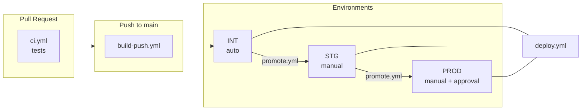

# IDS Workflows

Reusable GitHub Actions workflows for IDS microservices CI/CD.

## Overview



> **Note**: `promote.yml` adds a new tag to the existing image without rebuilding.

## Workflows

| Workflow | Description | Trigger |
|----------|-------------|---------|
| `ci.yml` | Run tests via Docker | PR |
| `build-push.yml` | Build & push to ECR | Push to main |
| `deploy.yml` | Deploy to ECS Fargate | Manual / Auto |
| `promote.yml` | Promote image between envs (no rebuild) | Manual |

## Usage in Microservices

### 1. CI (Pull Request)

```yaml
# .github/workflows/ci.yml
name: CI

on:
  pull_request:
    branches: [main]

jobs:
  test:
    uses: innovds/ids-workflows/.github/workflows/ci.yml@main
    secrets:
      MAVEN_SETTINGS: ${{ secrets.MAVEN_SETTINGS }}
```

### 2. Build & Deploy INT (Push to main)

```yaml
# .github/workflows/build-deploy.yml
name: Build & Deploy INT

on:
  push:
    branches: [main]

jobs:
  build:
    uses: innovds/ids-workflows/.github/workflows/build-push.yml@main
    with:
      ecr-repository: app/iam-ms
      environment-tag: int
    secrets:
      AWS_ROLE_TO_ASSUME: ${{ secrets.AWS_ROLE_TO_ASSUME }}
      MAVEN_SETTINGS: ${{ secrets.MAVEN_SETTINGS }}

  deploy-int:
    needs: build
    uses: innovds/ids-workflows/.github/workflows/deploy.yml@main
    with:
      environment: int
      ecr-repository: app/iam-ms
      image-tag: ${{ needs.build.outputs.image-tag }}
      cluster-name: ids-cluster-int
      service-name: iam-ms
      task-definition-family: iam-ms-int
      container-name: iam-ms
    secrets:
      AWS_ROLE_TO_ASSUME: ${{ secrets.AWS_ROLE_TO_ASSUME }}
```

### 3. Deploy STG (Manual)

```yaml
# .github/workflows/deploy-stg.yml
name: Deploy STG

on:
  workflow_dispatch:
    inputs:
      image-tag:
        description: 'Image tag to deploy (e.g., sha-abc1234)'
        required: true
        type: string

jobs:
  promote:
    uses: innovds/ids-workflows/.github/workflows/promote.yml@main
    with:
      ecr-repository: app/iam-ms
      source-tag: ${{ inputs.image-tag }}
      target-tag: stg
    secrets:
      AWS_ROLE_TO_ASSUME: ${{ secrets.AWS_ROLE_TO_ASSUME }}

  deploy:
    needs: promote
    uses: innovds/ids-workflows/.github/workflows/deploy.yml@main
    with:
      environment: stg
      ecr-repository: app/iam-ms
      image-tag: ${{ inputs.image-tag }}
      cluster-name: ids-cluster-stg
      service-name: iam-ms
      task-definition-family: iam-ms-stg
      container-name: iam-ms
    secrets:
      AWS_ROLE_TO_ASSUME: ${{ secrets.AWS_ROLE_TO_ASSUME }}
```

### 4. Deploy PROD (Manual + Approval)

```yaml
# .github/workflows/deploy-prod.yml
name: Deploy PROD

on:
  workflow_dispatch:
    inputs:
      image-tag:
        description: 'Image tag to deploy (e.g., sha-abc1234)'
        required: true
        type: string

jobs:
  promote:
    uses: innovds/ids-workflows/.github/workflows/promote.yml@main
    with:
      ecr-repository: app/iam-ms
      source-tag: ${{ inputs.image-tag }}
      target-tag: prod
    secrets:
      AWS_ROLE_TO_ASSUME: ${{ secrets.AWS_ROLE_TO_ASSUME }}

  deploy:
    needs: promote
    uses: innovds/ids-workflows/.github/workflows/deploy.yml@main
    with:
      environment: prod  # Requires approval via GitHub Environment
      ecr-repository: app/iam-ms
      image-tag: ${{ inputs.image-tag }}
      cluster-name: ids-cluster-prod
      service-name: iam-ms
      task-definition-family: iam-ms-prod
      container-name: iam-ms
    secrets:
      AWS_ROLE_TO_ASSUME: ${{ secrets.AWS_ROLE_TO_ASSUME }}
```

## Configuration Required

### GitHub Organization Secrets

| Secret | Description |
|--------|-------------|
| `AWS_ROLE_TO_ASSUME` | AWS IAM Role ARN for OIDC authentication |
| `MAVEN_SETTINGS` | Maven settings.xml content (if private repos) |

### GitHub Environments

Create these environments in each repository:

| Environment | Protection Rules |
|-------------|-----------------|
| `int` | None (auto-deploy) |
| `stg` | Optional: 1 reviewer |
| `prod` | Required: 2+ reviewers |

### AWS OIDC Setup

1. Create OIDC Identity Provider in AWS IAM for GitHub Actions
2. Create IAM Role with trust policy:

```json
{
  "Version": "2012-10-17",
  "Statement": [
    {
      "Effect": "Allow",
      "Principal": {
        "Federated": "arn:aws:iam::857736876208:oidc-provider/token.actions.githubusercontent.com"
      },
      "Action": "sts:AssumeRoleWithWebIdentity",
      "Condition": {
        "StringEquals": {
          "token.actions.githubusercontent.com:aud": "sts.amazonaws.com"
        },
        "StringLike": {
          "token.actions.githubusercontent.com:sub": "repo:innovds/*:*"
        }
      }
    }
  ]
}
```

3. Attach policies for ECR and ECS access

### Branch Protection (main)

- ✅ Require pull request before merging
- ✅ Require status checks to pass: `test`
- ✅ Require branches to be up to date

## Composite Actions

Available in `actions/` directory:

| Action | Description |
|--------|-------------|
| `docker-build` | Build Docker image with BuildKit cache |
| `ecr-push` | Login to ECR and push image |
| `ecs-deploy` | Deploy to ECS Fargate |

## Principles

1. **Docker-only**: No Java/Maven setup on runners, everything via Dockerfile
2. **Build once, deploy everywhere**: Same image promoted across environments
3. **OIDC authentication**: No static AWS credentials
4. **Environment gates**: Approvals required for production
