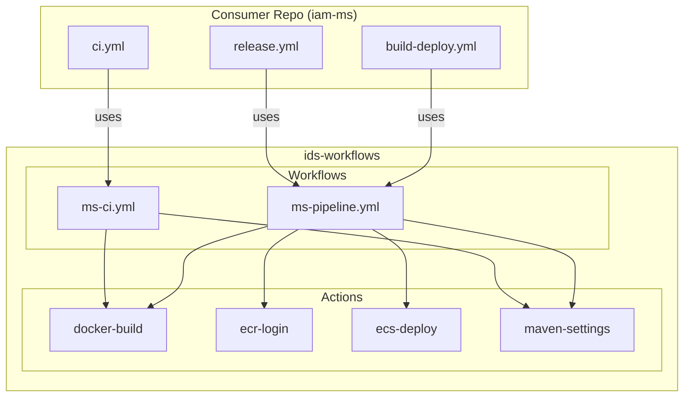
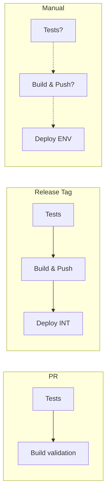
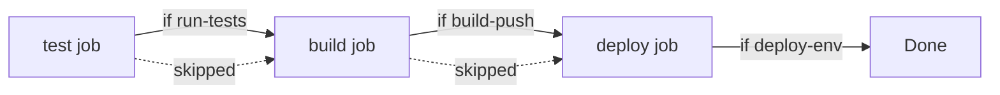

# IDS Workflows

Reusable GitHub Actions workflows for IDS microservices CI/CD.

## Architecture



## Workflow Types



> **Principe**: Build once, deploy everywhere (même image promue entre envs via `sha-{commit}`)
>
> **Image tags**: Chaque build push `sha-{commit}` (immutable) + `latest` (toujours à jour)

---

## Consumer Repo Example (iam-ms)

| Workflow | Trigger | Description |
|----------|---------|-------------|
| `ci.yml` | PR → main | Tests + build validation |
| `release.yml` | Tag `releases/v*` | Tests → Build → Push → Deploy INT |
| `build-deploy.yml` | 🔘 Manual | Build et/ou deploy vers int/stg/prod |

**Promotion workflow** :
1. Tag `releases/v1.0.0` → build `sha-abc1234` + `latest`, deploy INT
2. Valider en INT
3. Actions → `Build & Deploy` → `stg`, décocher `build-image`, tag = `sha-abc1234`
4. Valider en STG
5. Répéter pour `prod` avec le même tag

---

## Quick Start

```bash
# 1. Initialiser les workflows pour un microservice
./scripts/init-repo.sh /path/to/my-service my-service

# 2. Configurer les secrets GitHub
./scripts/setup-secrets.sh --repo your-org/my-service --aws-role-arn arn:aws:iam::123456:role/github-actions
```

---

## Shared Workflows

### `ms-ci.yml` - CI Pipeline

Validation des PRs : tests + build image (sans push).

```yaml
jobs:
  ci:
    uses: ids-aws/ids-workflows/.github/workflows/ms-ci.yml@main
    with:
      service-name: my-service
      run-tests: true
      build-validation: true
    secrets:
      MAVEN_SETTINGS_XML: ${{ secrets.MAVEN_SETTINGS_XML }}
```

#### Inputs

| Input | Type | Required | Default | Description |
|-------|------|----------|---------|-------------|
| `service-name` | string | ✅ | - | Nom du service |
| `run-tests` | boolean | ❌ | `true` | Exécuter les tests (target: test) |
| `build-validation` | boolean | ❌ | `true` | Valider le build (target: final, sans push) |

#### Secrets

| Secret | Required | Description |
|--------|----------|-------------|
| `MAVEN_SETTINGS_XML` | ❌ | settings.xml encodé en base64 |

---

### `ms-pipeline.yml` - Full Pipeline

Pipeline complet : tests → build → push → deploy.

```yaml
jobs:
  pipeline:
    uses: ids-aws/ids-workflows/.github/workflows/ms-pipeline.yml@main
    with:
      service-name: my-service
      run-tests: true
      build-push: true
      deploy-env: int
    secrets:
      AWS_ROLE_TO_ASSUME: ${{ secrets.AWS_ROLE_TO_ASSUME }}
      MAVEN_SETTINGS_XML: ${{ secrets.MAVEN_SETTINGS_XML }}
```

#### Inputs

| Input | Type | Required | Default | Description |
|-------|------|----------|---------|-------------|
| `service-name` | string | ✅ | - | Nom du service |
| `ecr-repository` | string | ❌ | `app/{service-name}` | Repository ECR |
| `aws-account-id` | string | ❌ | `857736876208` | ID compte AWS |
| `aws-region` | string | ❌ | `eu-west-1` | Région AWS |
| `run-tests` | boolean | ❌ | `false` | Exécuter les tests |
| `build-push` | boolean | ❌ | `false` | Build et push image |
| `deploy-env` | string | ❌ | `""` | Environnement (int/stg/prod) |
| `image-tag` | string | ❌ | `""` | Tag image existante (si pas de build) |
| `cluster-prefix` | string | ❌ | `ids-cluster` | Préfixe cluster ECS |

#### Secrets

| Secret | Required | Description |
|--------|----------|-------------|
| `AWS_ROLE_TO_ASSUME` | ❌ | ARN du rôle IAM pour OIDC |
| `MAVEN_SETTINGS_XML` | ❌ | settings.xml encodé en base64 |

#### Outputs

| Output | Description |
|--------|-------------|
| `image-tag` | Tag de l'image buildée (ex: `sha-abc1234`) |

#### Flow



---

## Shared Actions

### `docker-build`

Action unifiée pour build Docker (tests et production).

```yaml
- uses: ids-aws/ids-workflows/actions/docker-build@main
  with:
    target: final
    push: 'true'
    registry: 123456.dkr.ecr.eu-west-1.amazonaws.com
    repository: app/my-service
    image-tag: sha-abc1234
    maven-settings-path: ${{ steps.maven.outputs.settings-path }}
```

#### Inputs

| Input | Required | Default | Description |
|-------|----------|---------|-------------|
| `target` | ❌ | `final` | Docker build target |
| `dockerfile` | ❌ | `Dockerfile` | Chemin Dockerfile |
| `build-args` | ❌ | `""` | Arguments build (KEY=VALUE) |
| `push` | ❌ | `false` | Push vers registry |
| `registry` | ❌* | `""` | URL registry (*requis si push) |
| `repository` | ❌* | `""` | Nom repository (*requis si push) |
| `image-tag` | ❌* | `""` | Tag image (*requis si push) |
| `extra-tags` | ❌ | `""` | Tags additionnels |
| `maven-settings-path` | ❌ | `""` | Chemin settings.xml |

#### Outputs

| Output | Description |
|--------|-------------|
| `image-uri` | URI complète image (si push) |
| `digest` | Digest image (si push) |

#### Exemples

**Tests uniquement :**
```yaml
- uses: ids-aws/ids-workflows/actions/docker-build@main
  with:
    target: test
    push: 'false'
```

**Build + Push ECR :**
```yaml
- uses: ids-aws/ids-workflows/actions/docker-build@main
  with:
    target: final
    push: 'true'
    registry: 123456.dkr.ecr.eu-west-1.amazonaws.com
    repository: app/my-service
    image-tag: v1.0.0
```

**Build + Push Docker Hub :**
```yaml
- uses: docker/login-action@v3
  with:
    username: ${{ secrets.DOCKER_USER }}
    password: ${{ secrets.DOCKER_TOKEN }}

- uses: ids-aws/ids-workflows/actions/docker-build@main
  with:
    push: 'true'
    registry: docker.io
    repository: myorg/myapp
    image-tag: latest
```

---

### `ecr-login`

Login AWS ECR via OIDC (pas de credentials statiques).

```yaml
- uses: ids-aws/ids-workflows/actions/ecr-login@main
  with:
    aws-role: ${{ secrets.AWS_ROLE_TO_ASSUME }}
    aws-region: eu-west-1
```

#### Inputs

| Input | Required | Default | Description |
|-------|----------|---------|-------------|
| `aws-role` | ✅ | - | ARN du rôle IAM |
| `aws-region` | ❌ | `eu-west-1` | Région AWS |

#### Outputs

| Output | Description |
|--------|-------------|
| `registry` | URL du registry ECR |

---

### `ecs-deploy`

Déploiement ECS Fargate.

```yaml
- uses: ids-aws/ids-workflows/actions/ecs-deploy@main
  with:
    aws-role: ${{ secrets.AWS_ROLE_TO_ASSUME }}
    cluster-name: ids-cluster-int
    service-name: my-service
    task-family: my-service-int
    container-name: my-service
    image-uri: 123456.dkr.ecr.eu-west-1.amazonaws.com/app/my-service:sha-abc1234
```

#### Inputs

| Input | Required | Default | Description |
|-------|----------|---------|-------------|
| `aws-role` | ✅ | - | ARN du rôle IAM |
| `aws-region` | ❌ | `eu-west-1` | Région AWS |
| `cluster-name` | ✅ | - | Nom cluster ECS |
| `service-name` | ✅ | - | Nom service ECS |
| `task-family` | ✅ | - | Famille task definition |
| `container-name` | ✅ | - | Nom container dans task |
| `image-uri` | ✅ | - | URI image à déployer |
| `wait` | ❌ | `true` | Attendre stabilité service |

---

### `maven-settings`

Prépare settings.xml depuis un secret base64.

```yaml
- uses: ids-aws/ids-workflows/actions/maven-settings@main
  id: maven
  with:
    settings-base64: ${{ secrets.MAVEN_SETTINGS_XML }}

- run: echo "Settings at ${{ steps.maven.outputs.settings-path }}"
```

#### Inputs

| Input | Required | Default | Description |
|-------|----------|---------|-------------|
| `settings-base64` | ❌ | `""` | settings.xml encodé base64 |

#### Outputs

| Output | Description |
|--------|-------------|
| `settings-path` | Chemin vers settings.xml |

---

## Configuration Multi-Org

Le repo utilise des templates avec placeholders pour supporter plusieurs organisations.

```bash
# Structure
templates/           # Sources avec {{ORG_NAME}}, {{AWS_ACCOUNT_ID}}, etc.
config.example.sh    # Template config
config.local.sh      # Config locale (gitignored)
scripts/render.sh    # Génère les fichiers

# Usage
cp config.example.sh config.local.sh
vim config.local.sh  # Adapter les valeurs
./scripts/render.sh
```

**Placeholders :**

| Variable | Exemple |
|----------|---------|
| `{{ORG_NAME}}` | `ids-aws` |
| `{{AWS_ACCOUNT_ID}}` | `857736876208` |
| `{{AWS_REGION}}` | `eu-west-1` |

---

## Secrets GitHub

| Secret | Description |
|--------|-------------|
| `MAVEN_SETTINGS_XML` | `base64 -i settings.xml` |
| `AWS_ROLE_TO_ASSUME` | ARN rôle IAM OIDC |

---

## Structure

```
ids-workflows/
├── .github/workflows/
│   ├── ms-ci.yml            # Workflow réutilisable CI
│   ├── ms-pipeline.yml      # Workflow réutilisable pipeline complet
│   └── check-templates.yml  # CI interne (sync templates)
├── actions/
│   ├── docker-build/        # Build Docker unifié
│   ├── ecr-login/           # Login ECR OIDC
│   ├── ecs-deploy/          # Deploy ECS Fargate
│   └── maven-settings/      # Prépare Maven
├── templates/               # Sources avec {{placeholders}}
├── scripts/
│   ├── render.sh            # Génère depuis templates
│   ├── init-repo.sh         # Init workflows pour MS
│   ├── setup-secrets.sh     # Configure secrets GitHub
│   └── protect-branch.sh    # Protection branche main
└── docs/
    └── aws-oidc-setup.md    # Guide config OIDC AWS
```

---

## Principes

1. **Docker-only** : Pas de setup Java/Maven sur runners
2. **Build once, deploy everywhere** : Même image entre environnements
3. **Registry-agnostic** : Support ECR, Docker Hub, GHCR...
4. **OIDC** : Pas de credentials AWS statiques
5. **DRY** : Actions et workflows réutilisables
