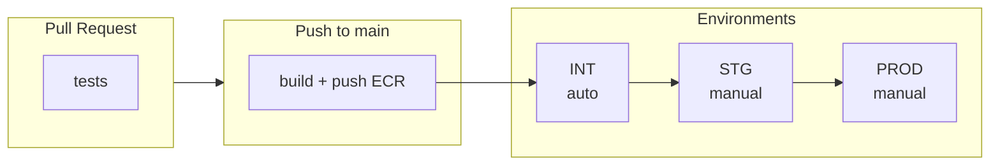

# IDS Workflows

Reusable GitHub Actions workflows for IDS microservices CI/CD.

## Overview



> **Principe**: Build once, deploy everywhere (même image promue entre envs, pas de rebuild)

## Quick Start

```bash
# 1. Générer les workflows pour un MS
./scripts/init-repo.sh /path/to/billing-ms billing-ms

# 2. Configurer les secrets
./scripts/setup-secrets.sh --repo innovds/billing-ms
```

## Workflows générés par MS (~68 lignes total)

| Fichier | Lignes | Description |
|---------|--------|-------------|
| `ci.yml` | 13 | PR → Tests |
| `build-deploy.yml` | 17 | Push main → Build → Deploy INT |
| `deploy-stg.yml` | 19 | Manuel → Deploy STG |
| `deploy-prod.yml` | 19 | Manuel → Deploy PROD |

### Exemple: ci.yml (13 lignes)

```yaml
name: CI
on:
  pull_request:
    branches: [main]

jobs:
  test:
    uses: innovds/ids-workflows/.github/workflows/ms-pipeline.yml@main
    with:
      service-name: iam-ms
      run-tests: true
    secrets:
      MAVEN_SETTINGS_XML: ${{ secrets.MAVEN_SETTINGS_XML }}
```

### Exemple: build-deploy.yml (17 lignes)

```yaml
name: Build & Deploy INT
on:
  push:
    branches: [main]

jobs:
  pipeline:
    uses: innovds/ids-workflows/.github/workflows/ms-pipeline.yml@main
    with:
      service-name: iam-ms
      run-tests: true
      build-push: true
      deploy-env: int
    secrets:
      AWS_ROLE_TO_ASSUME: ${{ secrets.AWS_ROLE_TO_ASSUME }}
      MAVEN_SETTINGS_XML: ${{ secrets.MAVEN_SETTINGS_XML }}
```

### Exemple: deploy-stg.yml / deploy-prod.yml (19 lignes)

```yaml
name: Deploy STG
on:
  workflow_dispatch:
    inputs:
      image-tag:
        description: 'Image tag (e.g., sha-abc1234)'
        required: true

jobs:
  deploy:
    uses: innovds/ids-workflows/.github/workflows/ms-pipeline.yml@main
    with:
      service-name: iam-ms
      run-tests: false
      build-push: false
      deploy-env: stg
      image-tag: ${{ inputs.image-tag }}
    secrets:
      AWS_ROLE_TO_ASSUME: ${{ secrets.AWS_ROLE_TO_ASSUME }}
```

## Configuration

### GitHub Secrets (par repository)

> **GitHub Free** : pas de secrets d'organisation, chaque repo définit ses propres secrets.

| Secret | Description |
|--------|-------------|
| `MAVEN_SETTINGS_XML` | Maven settings.xml encodé en base64 |
| `AWS_ROLE_TO_ASSUME` | ARN du rôle IAM pour OIDC |

### Sécurité des déploiements (GitHub Free)

GitHub Free ne supporte pas les environment protection rules pour les repos privés.

| Environnement | Protection |
|---------------|------------|
| **INT** | Auto-deploy sur push to main |
| **STG** | `workflow_dispatch` = seuls les maintainers peuvent trigger |
| **PROD** | `workflow_dispatch` + restriction possible via AWS IAM |

### AWS OIDC Setup

```json
{
  "Version": "2012-10-17",
  "Statement": [
    {
      "Effect": "Allow",
      "Principal": {
        "Federated": "arn:aws:iam::857736876208:oidc-provider/token.actions.githubusercontent.com"
      },
      "Action": "sts:AssumeRoleWithWebIdentity",
      "Condition": {
        "StringEquals": {
          "token.actions.githubusercontent.com:aud": "sts.amazonaws.com"
        },
        "StringLike": {
          "token.actions.githubusercontent.com:sub": "repo:innovds/*:*"
        }
      }
    }
  ]
}
```

## Structure du repo

```
ids-workflows/
├── .github/workflows/
│   └── ms-pipeline.yml      # Workflow unifié (appelé par tous les MS)
├── actions/
│   ├── maven-settings/      # Prépare settings.xml
│   ├── docker-test/         # Tests via Docker
│   ├── docker-build-push/   # Build + Push ECR
│   └── ecs-deploy/          # Deploy Fargate
├── scripts/
│   ├── init-repo.sh         # Génère workflows pour un MS
│   └── setup-secrets.sh     # Configure secrets GitHub + AWS OIDC
└── README.md
```

## Principes

1. **Docker-only** : Pas de setup Java/Maven sur les runners, tout via Dockerfile
2. **Build once, deploy everywhere** : Même image promue entre environnements
3. **OIDC** : Pas de credentials AWS statiques
4. **Factorisation** : Un seul workflow partagé (`ms-pipeline.yml`), ~68 lignes par MS
