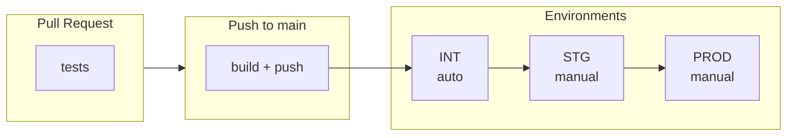

# IDS Workflows

Reusable GitHub Actions workflows for IDS microservices CI/CD.

## Overview



> **Principe**: Build once, deploy everywhere (même image promue entre envs)

## Quick Start

```bash
# 1. Configurer pour votre org (optionnel si fork)
cp config.example.sh config.local.sh
# Éditer config.local.sh avec vos valeurs
./scripts/render.sh

# 2. Générer les workflows pour un microservice
./scripts/init-repo.sh /path/to/billing-ms billing-ms

# 3. Configurer les secrets GitHub
./scripts/setup-secrets.sh --repo your-org/billing-ms
```

## Configuration multi-org

Le repo utilise un système de templates avec placeholders pour supporter plusieurs organisations/clients.

```bash
# Structure
templates/           # Sources avec {{ORG_NAME}}, {{AWS_ACCOUNT_ID}}, etc.
config.example.sh    # Template de config
config.local.sh      # Votre config (gitignored)
scripts/render.sh    # Génère les fichiers finaux

# Workflow
cp config.example.sh config.local.sh
vim config.local.sh  # Adapter les valeurs
./scripts/render.sh  # Générer les fichiers
```

**Variables disponibles :**

| Variable | Description | Exemple |
|----------|-------------|---------|
| `ORG_NAME` | Organisation GitHub | `ids-aws` |
| `AWS_ACCOUNT_ID` | ID compte AWS | `857736876208` |
| `AWS_REGION` | Région AWS | `eu-west-1` |
| `ECR_REGISTRY` | Registry ECR (dérivé) | `857736876208.dkr.ecr.eu-west-1.amazonaws.com` |

## Actions composables

| Action | Description | Registry |
|--------|-------------|----------|
| `docker-build-push` | Build & push image | **Tout registry** |
| `ecr-login` | Login AWS ECR via OIDC | ECR |
| `docker-test` | Tests via Docker target | - |
| `maven-settings` | Prépare settings.xml | - |
| `ecs-deploy` | Deploy ECS Fargate | AWS |

### Exemple : Push vers Docker Hub

```yaml
- uses: docker/login-action@v3
  with:
    username: ${{ secrets.DOCKER_USERNAME }}
    password: ${{ secrets.DOCKER_PASSWORD }}

- uses: your-org/ids-workflows/actions/docker-build-push@main
  with:
    registry: docker.io
    repository: myorg/myapp
    image-tag: ${{ github.sha }}
```

### Exemple : Push vers GHCR

```yaml
- uses: docker/login-action@v3
  with:
    registry: ghcr.io
    username: ${{ github.actor }}
    password: ${{ secrets.GITHUB_TOKEN }}

- uses: your-org/ids-workflows/actions/docker-build-push@main
  with:
    registry: ghcr.io
    repository: ${{ github.repository }}
    image-tag: ${{ github.sha }}
```

### Exemple : Push vers ECR (workflow par défaut)

```yaml
- uses: your-org/ids-workflows/actions/ecr-login@main
  with:
    aws-role: ${{ secrets.AWS_ROLE_TO_ASSUME }}

- uses: your-org/ids-workflows/actions/docker-build-push@main
  with:
    registry: 123456.dkr.ecr.eu-west-1.amazonaws.com
    repository: app/myservice
    image-tag: sha-abc1234
```

## Workflows générés par microservice

| Fichier | Description |
|---------|-------------|
| `ci.yml` | PR → Tests |
| `build-deploy.yml` | Push main → Build → Deploy INT |
| `deploy-stg.yml` | Manuel → Deploy STG |
| `deploy-prod.yml` | Manuel → Deploy PROD |

## Configuration GitHub

### Secrets (par repository)

> **GitHub Free** : pas de secrets d'organisation, chaque repo définit ses propres secrets.

| Secret | Description |
|--------|-------------|
| `MAVEN_SETTINGS_XML` | Maven settings.xml encodé en base64 |
| `AWS_ROLE_TO_ASSUME` | ARN du rôle IAM pour OIDC |

### Sécurité des déploiements

| Environnement | Protection |
|---------------|------------|
| **INT** | Auto-deploy sur push to main |
| **STG** | `workflow_dispatch` = seuls les maintainers |
| **PROD** | `workflow_dispatch` + restriction AWS IAM possible |

## Structure du repo

```
ids-workflows/
├── .github/workflows/
│   └── ms-pipeline.yml         # Workflow unifié (généré)
├── actions/
│   ├── docker-build-push/      # Build & push (multi-registry)
│   ├── docker-test/            # Tests Docker
│   ├── ecr-login/              # Login ECR
│   ├── ecs-deploy/             # Deploy Fargate
│   └── maven-settings/         # Prépare Maven
├── templates/                  # Sources avec {{placeholders}}
├── scripts/
│   ├── render.sh               # Génère depuis templates
│   ├── init-repo.sh            # Init workflows MS
│   └── setup-secrets.sh        # Configure secrets
├── config.example.sh           # Template config
└── README.md
```

## Principes

1. **Docker-only** : Pas de setup Java/Maven sur runners
2. **Build once, deploy everywhere** : Même image entre environnements
3. **Registry-agnostic** : Support ECR, Docker Hub, GHCR, GCR...
4. **OIDC** : Pas de credentials AWS statiques
5. **Composable** : Actions réutilisables indépendamment

## Extensibilité future

- `k8s-deploy/` : Déploiement Kubernetes (kubectl)
- `helm-deploy/` : Déploiement via Helm
- `ghcr-login/` : Login GitHub Container Registry
